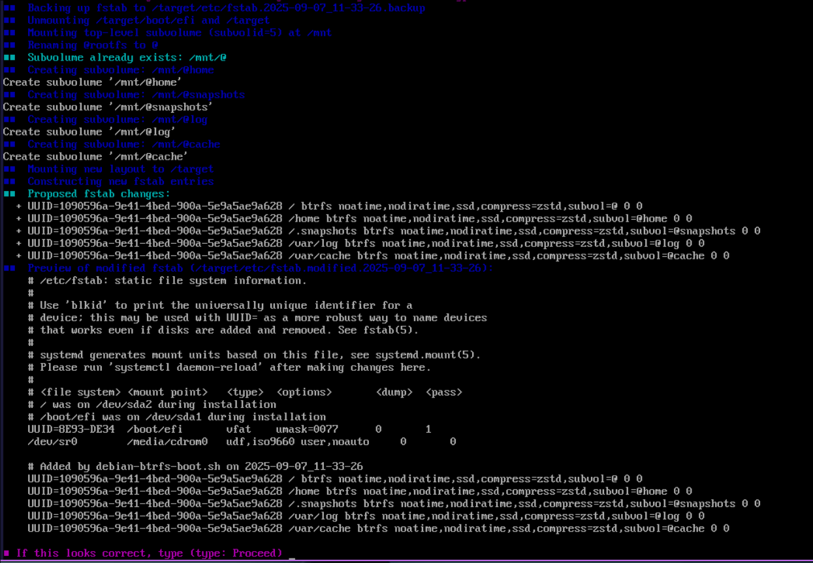
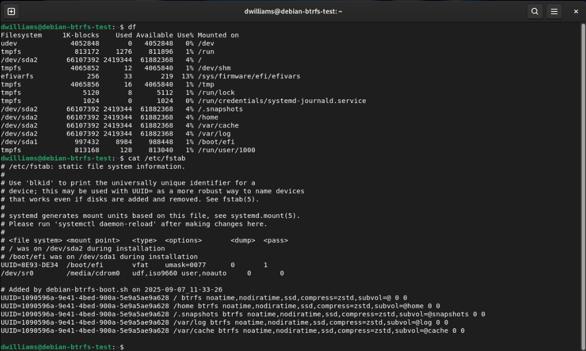

# debian-btrfs-boot 🛠️✅

Read this in: [English](README.md) | [Español](README.es.md)

- This project is under active development. Use at your own risk.

## IMPORTANT ASSUMPTIONS

- UEFI firmware and GPT partition table are required.
- Single root mount point (/) on one Btrfs partition (no separate root/home/var partitions expected).
- No swap space configured. If swap exists, this script may not apply.

#### This script will configure a Debian 12/13+ system (during install) to use BTRFS subvolumes and support root snashots

- This was created from this JustAGuyLinux YouTube Video
  https://www.youtube.com/watch?v=_zC4S7TA1GI

- by JustAGuyLinux https://www.youtube.com/@JustAGuyLinux

---

## Highlights

- ✅ Safe and idempotent: backs up fstab, previews changes, and requires
  explicit confirmations.
- ⚠️ Guardrails: environment checks for Debian installer context, root, device
  types, and mount status.
- 🧩 Flexible: preserves key fstab options (e.g., ssd, noatime) while
  normalizing subvolumes and forcing compress=zstd.
- 📜 Detailed logs: install.TIMESTAMP.log with file contents and command
  results.
- 🎨 Colorful UX: ANSI-colored messages with icons for clarity.

### Screenshots

 

---

## When to run:

Run this script from the Debian Installer shell (CTRL + ALT + F2) after you have
partitioned and formatted the target drive, and the installer has mounted the
target system at /target and the EFI partition at /target/boot/efi.
This is before the package installation step.

## Reminder:

> - The boot disk root partiontion must be mounted on `/target`
> - For UEFI also EFI parition must be mounted on `/target/boot`

### Expected environment:

- Debian 12 or 13 installer
- GPT partitioning and UEFI firmware (/sys/firmware/efi present)
- /cdrom exists
- /target mounted as Btrfs root; /target/boot/efi mounted as vfat

---

### Resulting BTRFS layout

- @ -> /
- @home -> /home
- @snapshots -> /.snapshots
- @log -> /var/log
- @cache -> /var/cache

---

Quick start (download via wget) From the Debian installer shell (Ctrl+Alt+F2):

Primary (friendlier URL — GitHub raw redirect)

```bash
wget -qO debian-btrfs-boot.sh https://github.com/dwilliam62/debian-btrfs-boot/raw/main/debian-btrfs-boot.sh
chmod +x ./debian-btrfs-boot.sh
# Preview without making changes
./debian-btrfs-boot.sh --dry-run
```

Backup (raw.githubusercontent.com)

```bash
wget -qO debian-btrfs-boot.sh https://raw.githubusercontent.com/dwilliam62/debian-btrfs-boot/main/debian-btrfs-boot.sh
chmod +x ./debian-btrfs-boot.sh
# Preview without making changes
./debian-btrfs-boot.sh --dry-run
```

Script links:

- Repo view:
  https://github.com/dwilliam62/debian-btrfs-boot/blob/main/debian-btrfs-boot.sh
- Raw file (backup):
  https://raw.githubusercontent.com/dwilliam62/debian-btrfs-boot/main/debian-btrfs-boot.sh

Usage

1. From the Debian installer shell (Ctrl+Alt+F2), fetch the script with wget
   (see above) into a working dir.
2. Run with confirmations (recommended):

```bash
# Preview actions, no changes
./debian-btrfs-boot.sh --dry-run

# Perform actions interactively (requires typing YES then Proceed)
./debian-btrfs-boot.sh

# Non-interactive (if you know what you’re doing)
./debian-btrfs-boot.sh -y
```

Options:

- --dry-run Show what would happen without making changes
- -y, --yes Assume "YES" to proceed and "Proceed" to finalize
- --target PATH Target root mount point (default: /target)

Logging

- A detailed log is written to install.YYYY-MM-DD_HH-MM-SS.log in the current
  working directory.
- On successful completion (non-dry-run), the log is copied to the target
  system’s root user directory (e.g.,
  /target/root/install.YYYY-MM-DD_HH-MM-SS.log) for later review.

---

What the script does (high level)

1. Preflight checks (❌ abort on failure)
   - Root privileges, Debian installer context (/cdrom), /target and
     /target/boot/efi are mounted
   - Root fstype is btrfs; EFI fstype is vfat
   - /target/etc/fstab exists; parsed for current device specifiers and options
2. Confirmation (❓ type YES)
   - Shows detected devices and planned layout
3. Back up fstab (✅ safe copy to /target/etc/fstab.TIMESTAMP.backup)
4. Unmount /target/boot/efi and /target (⚠️ with clear messaging)
5. Mount top-level btrfs (subvolid=5) at /mnt
6. Rename @rootfs -> @ if needed; create @home, @snapshots, @log, @cache
   (idempotent)
7. Mount new subvolumes at /target
8. Re-mount EFI to /target/boot/efi
9. Build new fstab entries
   - Preserves existing non-subvol and non-compress options
   - Ensures noatime present; forces compress=zstd (overrides other compress
     settings)
   - Uses the same source specifier as the original root line (UUID=...,
     PARTUUID=..., LABEL=..., or /dev/...)
   - Sets dump/pass to 0 0 for btrfs entries
10. Show proposed fstab changes, write to fstab.modified.TIMESTAMP
11. Final confirmation (❓ type Proceed) or revert

- On abort, restores original fstab and saves modified copy as reverted

12. Install modified fstab and instruct to return to installer (✅ success)

---

Plan review, corrections, and guardrails

- Correct command typos and paths
  - mmount -> mount
  - /target/etc/fstb -> /target/etc/fstab
  - compress=ztd -> compress=zstd
  - /var/logs -> /var/log
- Subvolume rename sequence
  - Must mount the btrfs top-level (subvolid=5) to a work dir (e.g., /mnt)
    before renaming @rootfs to @ via mv /mnt/@rootfs /mnt/@
- Idempotency and detection
  - If @ exists already, skip rename
  - Create subvolumes only if missing; do not fail if they already exist
- Flexible options handling
  - Preserve existing options like ssd, noatime, autodefrag, etc., while
    normalizing subvol= options
  - The script always sets compress=zstd (it does not preserve other compress
    values)
- fstab fsck fields
  - Btrfs uses a no-op fsck; the script sets 0 0 for btrfs entries consistently
  - EFI line is preserved as-is
- Recovery and safety
  - Early backup of fstab with timestamp
  - Two-stage confirmation (YES before unmount; Proceed before install)
  - Clear DRY-RUN mode to safely preview changes
  - Logs all file reads/changes and command actions
  - Trap interrupts with a warning
- Environment checks
  - Requires Debian installer context (/cdrom), root, mounted /target and
    /target/boot/efi, and btrfs root

---

Troubleshooting

- Script says /target is not mounted
  - In the installer, use the guided install to mount target, or manually mount
    before running
- Root fstype is not btrfs
  - Revisit partitioning step; ensure the root partition is formatted as btrfs
- EFI is not vfat
  - Ensure the EFI System Partition is FAT32 and mounted at /target/boot/efi
- Subvolumes already exist
  - The script is idempotent; it will skip creation and proceed

---

Development

- Entry point: ./debian-btrfs-boot.sh
- Style: Bash, set -Eeuo pipefail; colored output with ANSI sequences and emoji
  icons
- Changes and logs: install.TIMESTAMP.log in working dir

License

- MIT — see LICENSE
